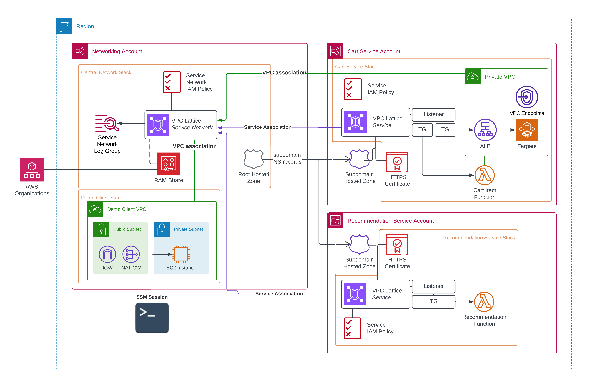

# VPC Lattice Demo

A multi-account AWS VPC Lattice with ECS and Lambda services.

## What is VPC Lattice?

VPC Lattice allows services in one account or multiple accounts to discover an communicate with other services without setting up VPC routing, Transit Gateway. 

VPC Lattice provides:
1. Inbound and outbound east-west connectivity with minimal network configuration
2. Support for services overlapping IP CIDR ranges
3. High-level access control and connectivity managed by central admin/ops teams
4. Fine-grained access control - with IAM and security groups
5. Service discovery and routing without sidecar proxies or routing tables
6. Traffic control, load balancing and path-based routing

Services can be backed by anything with an IP address, EC2 Instances, Application Load Balancers or Lambda Functions.

In order to create a Lambda-service, you do not need to associate it with a VPC. You only need a VPC to consume a service through VPC Lattice.

You can a full deep-dive on VPC Lattice in the [accompanying blog post](https://fourtheorem.com/blog/vpc-lattice) for this project.

## Structure

Normally, the services deployed to each separate account would be in separate CDK applications as they are managed by different teams. For simplicity, we keep all stacks in the same repository and CDK application.



The application assumes three accounts:

1. The central networking admin account
2. The cart service account
3. The recommendation service account


We will deploy:
- Base network stacks to each service account
- The central networking resources (including the VPC Lattice Service Network) to the networking account
- The cart service (with the VPC Lattice service) to the cart account
- The recommendation service (with the VPC Lattice service) to the recommendation account
- A demo client stack to the networking account, used to test the APIs end-to-end 

## Prerequisites

This demo uses Resource Access Manager to share the VPC Lattice Service Network within the AWS Organization.
You need to enable trusted access for RAM in your AWS Organizations management account.

```bash
# With Management Account credentials
aws ram enable-sharing-with-aws-organization
```

## Setup

You will need Node.js v16 or greater, Docker, and Python.

1. First, install the Node.js dependencies
```bash
npm install
```
2. Then, copy [cdk.context.json.template](./cdk.context.json.template) to `cdk.context.json`. Specify the values for each account ID, the organization ID and ARN, and Route53 Public Hosted Zone for the domain you want to use.
3. Bootstrap the CDK accounts. Each bootstrap step requires the right AWS credentials to be set up for the account in question. Make sure you set environment variables for the `..*ACCOUNT_ID`s or replace them with the literal values.
```bash
# With Cart Account credentials
npx cdk bootstrap --trust=${NETWORKING_ACCOUNT_ID} aws://${CART_ACCOUNT_ID}/eu-west-1
# With Recommendation Account credentials
npx cdk bootstrap --trust=${NETWORKING_ACCOUNT_ID} aws://${RECOMMENDATION_ACCOUNT_ID}/eu-west-1
# With Networking Account credentials
npx cdk bootstrap aws://${NETWORKING_ACCOUNT_ID}/eu-west-1
```

## Deployment

1. Set credentials for the networking account. The CDK bootstrap process has created trust roles for the other two accounts so there is no need to switch credentials from this point on.
2. Run the deploy script. The [deploy.mjs](./deploy.mjs) script is an [nx]() script that will run the right commands in sequence to deploy everything, fetching the output of stacks to pass to others as it goes.
```bash
./deploy.mjs --region eu-west-1
```

Once complete, all stacks have been deployed.

## Testing

1. Since our services run in private, isolated VPC subnets, we need to join the Lattice Service Network to make any client requests. We'll use an EC2 instance for that purpose. It can be deployed with the `DemoClient` stack:

```bash
cdk deploy DemoClient
```

2. Then, manually associated the `DemoClientVpc` with the VPC Lattice Service Network in the networking account using the AWS Console.

3. To run the test, open an SSM session to the EC2 instance on the AWS console, and type:

```bash
bash
cd
python3 -mpip install botocore
```

4. Create a file called `request.py` with the contents of [client/request.py](./client/request.py).
Make it executable:
```bash
chmod +x request.py
```

5. Now, you are ready to make requests to the cart service. Replace our domain (`awsbites.click`) with your domain and add an item ("Inflatable Unicorn Horn for Cats") to the cart.

```bash
./request.py -v --method POST https://service.cart.awsbites.click/items --data '{"cart_id": 123, "product_code": "INFLCAT"}' | python -m json.tool
```

```
POST https://service.cart.awsbites.click/items
Content-Type: application/json
X-Amz-Date: 20230705T105333Z
X-Amz-Security-Token: IQo........
X-Amz-Content-SHA256: UNSIGNED-PAYLOAD
Authorization: AWS4-HMAC-SHA256 Credential=ASIAOLDMCDONALD/20230705/eu-west-1/vpc-lattice-svcs/aws4_request, SignedHeaders=content-type;host;x-amz-content-sha256;x-amz-date;x-amz-security-token, Signature=2ca02eab1ece788ddd1801335b50790f1e730a4b22d9f99168defdfbe64f53ae
Content-Length: 43
{"cart_id": 123, "product_code": "INFLCAT"}
Status 200
date: Wed, 05 Jul 2023 10:53:33 GMT
content-type: application/json
content-length: 385
server: uvicorn
x-response-source: ECS
{
    "related_recommendations": [
        {
            "productCode": "UNICPLSH",
            "title": "Catnip-infused Unicorn Plush Toy"
        },
        {
            "productCode": "CATCOLLAR",
            "title": "Rainbow-Colored Cat Collar"
        },
        {
            "productCode": "UNICBED",
            "title": "Unicorn Themed Cat Bed"
        },
        {
            "productCode": "CATFOUNT",
            "title": "Sparkling Water Fountain for Cats"
        },
        {
            "productCode": "UNICHEAD",
            "title": "Unicorn Horn Headband for Cat Owners"
        }
    ],
    "status": "ADDED"
}
```

You should receive some output from the Lambda or ECS versions of the cart service endpoint, including the recommendations received from the recommendation service.
The response header, `x-response-source: ...`, indicates the compute service that served this request. Try some other requests to compare the response headers.


## Exploring the Application

Now that you have made some sample requests, take a look at the resources and logs in the AWS Console.
By exploring the Service Network logs, Service CloudWatch metrics, and VPC Flow logs, you'll get a sense of how powerful Lattice is for observability and auditing.

## Cleaning Up

These stacks include resources that can incur reasonable cost over time, including Lattice Services, VPC Endpoints and a NAT Gateway in the DemoClient stack. To remove all stacks:

1. Delete the manual VPC association between the DemoClient VPC and the Service Network
2. Delete the CNAME records from the cart and recommendation accounts in the respective accounts. These are not deleted automatically when the service stacks are deleted.
3. Destroy all CloudFormation stacks:
```bash
cdk destroy --all
```